<div align="center">

# blcaptain-ppt-skill

Turn an idea / article / dataset into **single-file HTML presentations across 7 visual personas — where both taste and honesty are machine-enforced**

**English** · [中文](README.zh-CN.md)

[](LICENSE)   

</div>

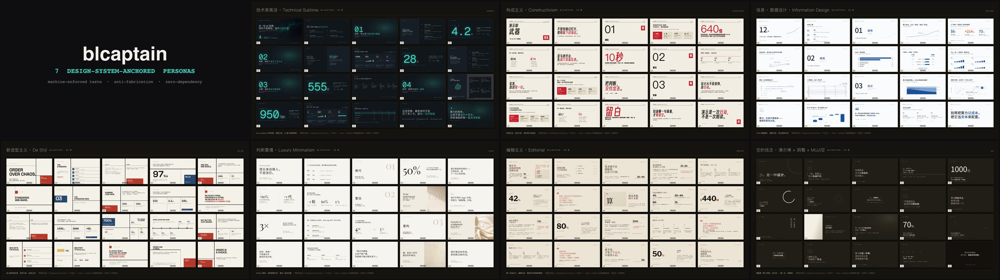

> **Install** — tell your agent (Codex / Claude Code / Cursor / Gemini CLI…): *"Install this Skill: `github.com/dososo/blcaptain-ppt-skill`"*

---

## The idea — Engineered Conviction

Most AI slides announce themselves at a glance: big color blocks, emoji, purple gradients, centered stacking, made-up numbers, random stock photos. The problem isn't that the model isn't trying — it's that **"looking good" is treated as mysticism**, left to luck, different every time.

But real presentation design — a technical report, a launch keynote, an industry analysis — **has a method**: how much the type scale should differ, how much whitespace to leave, which colors you must never use, how a dark slide stays readable on a projector, which numbers you may not invent. Recognized design systems have studied this for decades.

**blcaptain turns that craft into constraints a machine can enforce.** Every deck is a precisely-engineered object that carries **one judgment you can't dodge** — *precision × conviction*. The AI doesn't free-style a layout; it fills a validated one. So the output is **stably good, and honest** — every time, not by luck.

## The moat — what we refuse to do

> *"Good design is as little design as possible."* — Dieter Rams. The moat isn't a feature list; it's the discipline of what we **won't** ship.

- **Never fabricate** data / logos / screenshots / sources — unverifiable numbers are labeled `illustrative`, and it's **machine-checked**.
- **No emoji, no random stock photos** — the two loudest tells of AI slop.
- **One signal color, ~5%** — no multi-color clutter fighting for attention.
- **No decorative geometry** that carries no meaning — form serves content, never the reverse.
- **No frivolous font weights**, no all-rounded floating cards, no purple/blue/orange/pink gradients.
- **Never crowd out whitespace** to cram more in.
- **No unanchored, self-invented styles** — every persona anchors to a *recognized* design system, with sources.
- **No copying a single school** wholesale as a finished product.

## What you get

| | |
|---|---|
| **7 visual personas** | Each anchored to a **recognized design system** (not recolored templates): Technical Sublime · Constructivism · Information Design · Luxury Minimalism · De Stijl · Editorial · Zen. Auto-picked from your content, or specify it. |
| **Machine-enforced taste** | token + WCAG contrast gate + spacing-scale gate + P0/P1/P2 validation + a 32-dimension audit — taste compiled into **code constants**; every deck passes the floor or it doesn't ship. |
| **Anti-fabrication honesty** | No fake data / logos / screenshots / sources; unverifiable numbers marked `illustrative`, **enforced by machine**. |
| **Local fonts** | Fonts subset and packed *into* the deck — **never breaks offline or behind a firewall**, no CDN. |
| **Single-file HTML** | One deck = one `.html`: present in a browser · `Ctrl+P` for a precise 16:9 PDF · screenshot for social. |
| **Zero dependencies** | Scripts use only Node built-ins. `git clone` and go — **not one npm package**. |

## The 7 personas

Picking a persona isn't choosing decoration — it's claiming a **stance** (a design system). Each cover below is page 1 of that persona's 20-page demo:

| Cover | Persona · anchor | Use it for |
|:---:|---|---|
| 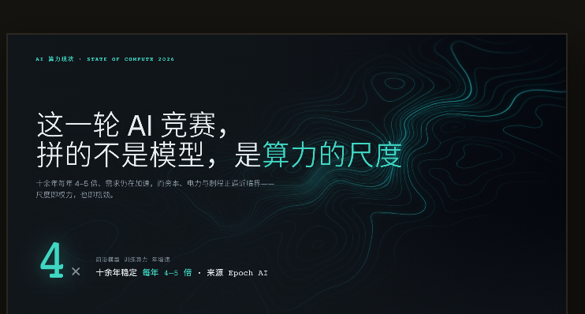 | **Technical Sublime** · 技术崇高<br><sub>Vercel / Linear / Stripe engineered cool + an iso-compute contour signature.</sub> | Tech reports · compute · AI · systems |
| 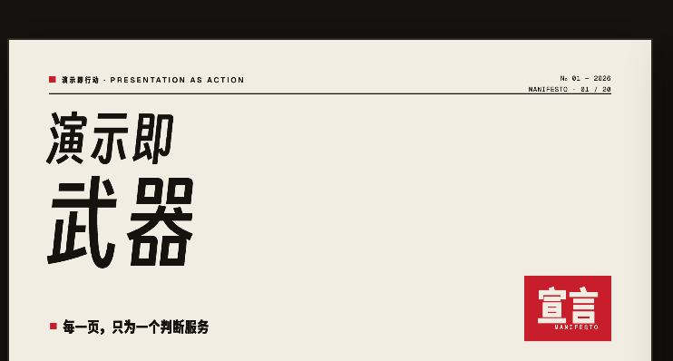 | **Constructivism** · 构成主义<br><sub>Rodchenko / El Lissitzky red-square acts + asymmetric tension.</sub> | Manifestos · strong claims · calls to action |
| 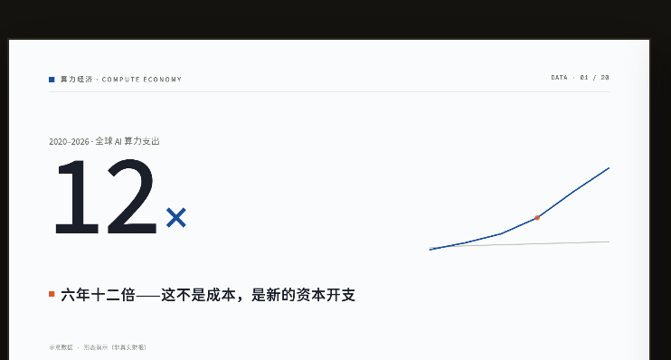 | **Information Design** · 信息·数据<br><sub>Tufte / FT / The Pudding chart grammar — data as the argument.</sub> | Data · trends · reports |
| 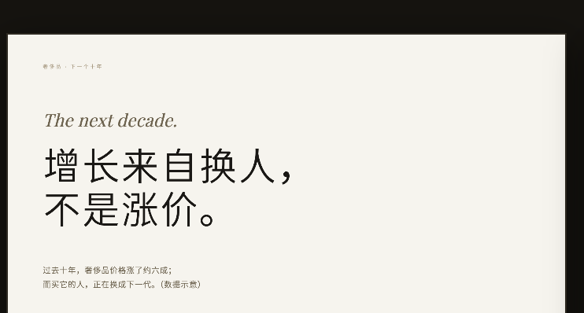 | **Luxury Minimalism** · 判断震慑<br><sub>Didone bare-color + whitespace-as-pricing.</sub> | Premium brand · judgment · product |
| 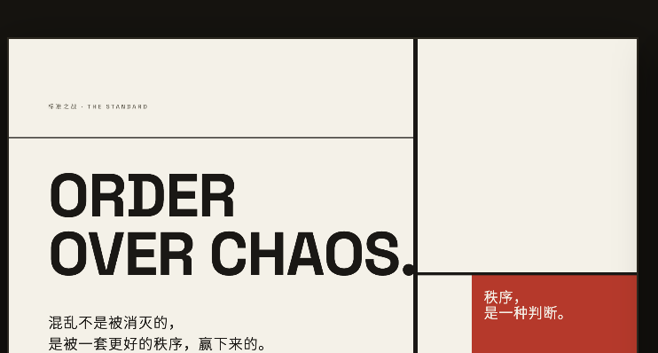 | **De Stijl** · 新造型<br><sub>Mondrian / Vignelli geometric sans + muted primaries.</sub> | Standards · order · system frameworks |
| 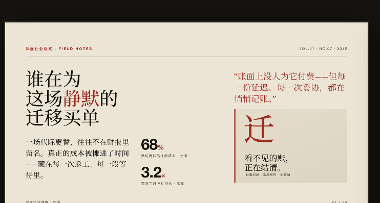 | **Editorial** · 编辑主义<br><sub>Magazine tradition + the only serif body of the seven.</sub> | In-depth analysis · long-form |
| 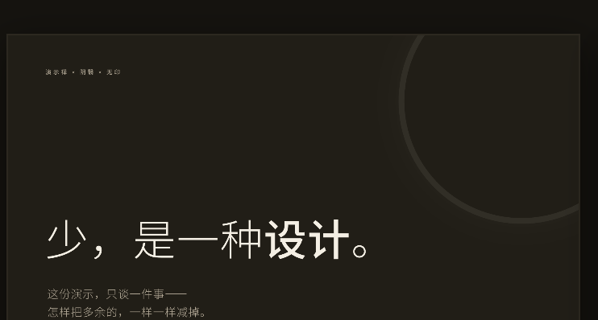 | **Zen** · 演示禅<br><sub>Zen × *In Praise of Shadows* × MUJI emptiness, dark-ink "second black".</sub> | Ideas · brand keynote *(narrow: one image, one thought — not data/pitches)* |

## Gallery — each persona, the full 20-page range

The covers above are page 1; here is every page of each demo (click to enlarge, or open the matching `templates/deck-<persona>.html` to see it live):

<table>
<tr>
<td align="center" width="50%">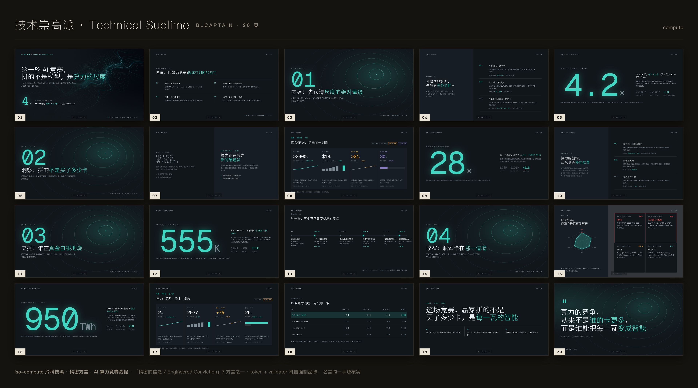<br/><sub><b>Technical Sublime</b> · engineered cool</sub></td>
<td align="center" width="50%">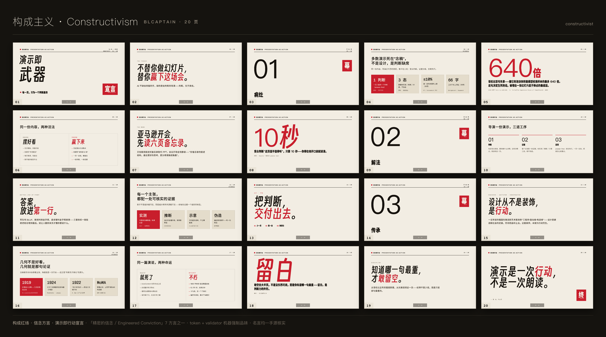<br/><sub><b>Constructivism</b> · red-square manifesto</sub></td>
</tr>
<tr>
<td align="center">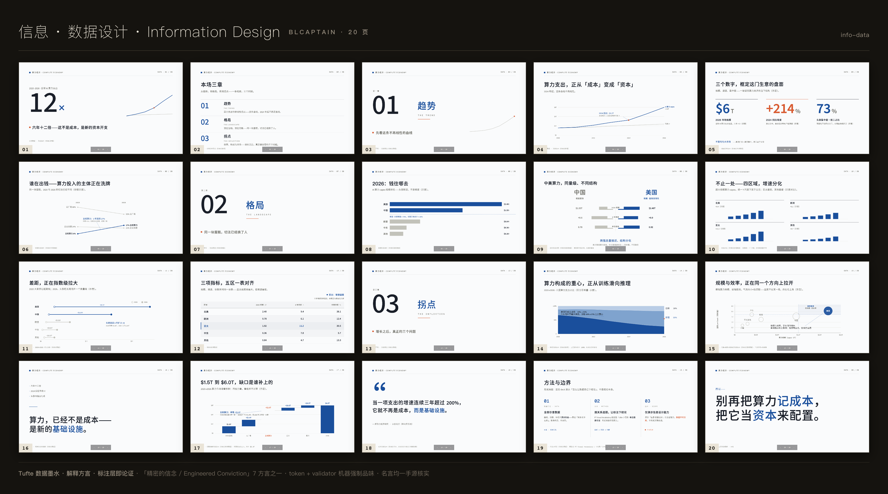<br/><sub><b>Information Design</b> · data as argument</sub></td>
<td align="center">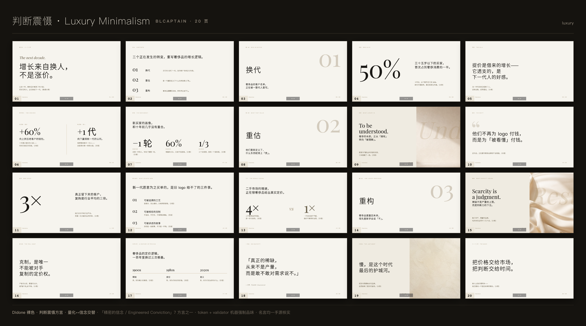<br/><sub><b>Luxury Minimalism</b> · bare color, priced whitespace</sub></td>
</tr>
<tr>
<td align="center">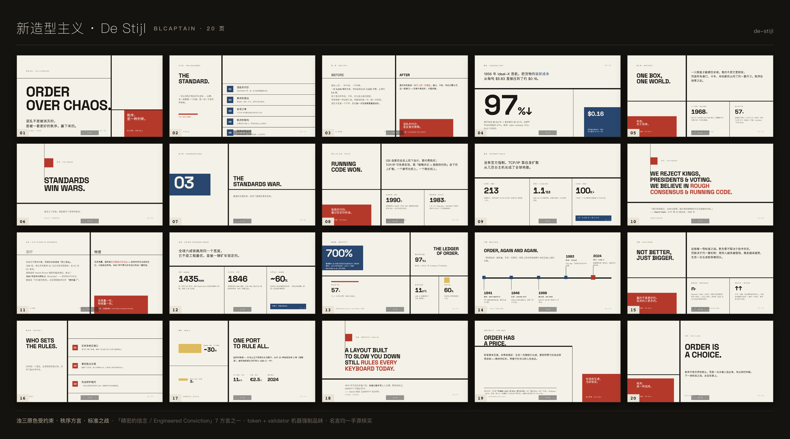<br/><sub><b>De Stijl</b> · muted primaries, pure order</sub></td>
<td align="center">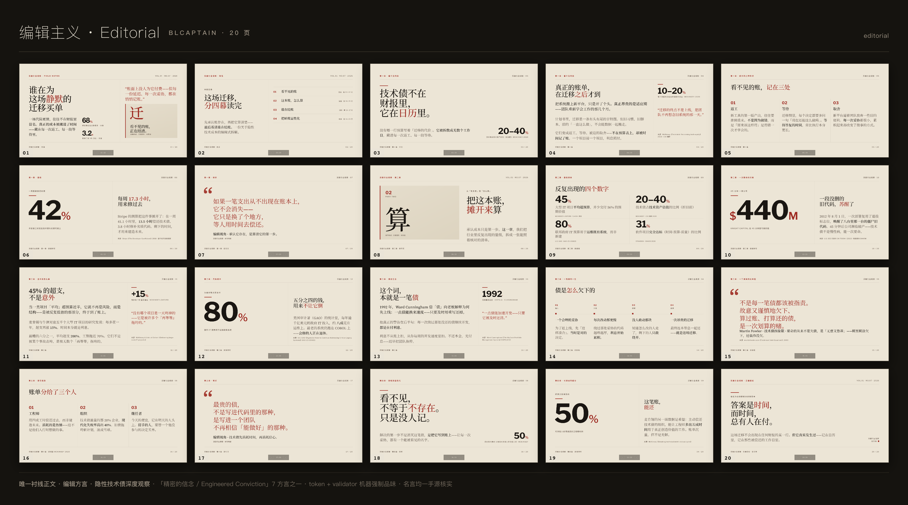<br/><sub><b>Editorial</b> · serif, magazine grid</sub></td>
</tr>
<tr>
<td align="center">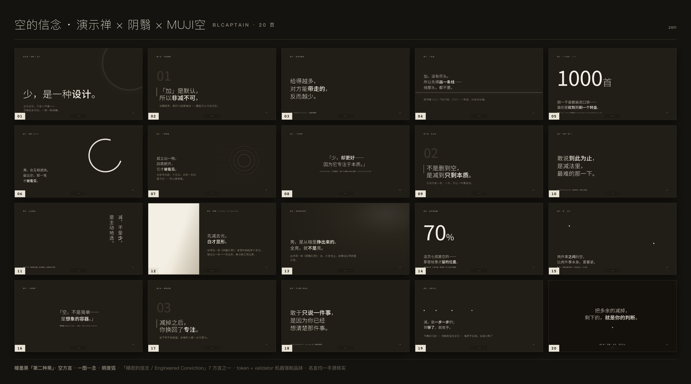<br/><sub><b>Zen</b> · dark ink, one thought a page</sub></td>
<td align="center" valign="center"><sub>7 personas = 7 time-tested design systems,<br/><b>not recolored templates</b>.<br/><br/>Each is 20 pages, all passing <code>P0=0</code> machine checks.<br/>Full-resolution images in <a href="docs/gallery/">docs/gallery/</a>.</sub></td>
</tr>
</table>

## Why it's different

| Dimension | Most AI deck tools | blcaptain |
|---|---|---|
| **Consistency** | Looks good *by luck* — different every run | **Machine-enforced floor** (WCAG / spacing / 32-dim audit) — passes or won't ship |
| **Depth vs breadth** | One template recolored for everything | **7 personas, each anchored to a recognized design system** |
| **Honesty** | Happily invents data, fakes screenshots | **Anti-fabrication, in writing and machine-checked** |
| **Fonts** | CDN fonts — break offline / behind a firewall | **Subset and packed into the deck**, never breaks |
| **Projection** | Dark slides often unreadable on a projector | **AAA contrast floor** so a live audience can read it |
| **Footprint** | npm + build chain | **Zero dependencies** — `git clone` and go |

## Not for

Large data tables / training material · legal / medical / financial compliance docs · multi-author PPT editing · plain-text summaries · replicating a brand's official keynote · fabricating realistic-looking data, logos, or screenshots. *A tool that does everything usually does nothing well.*

## How to use

Once installed, just talk to your agent:

```
Use blcaptain to turn this into a deck:
(paste your goal / article / data)
```

It reads the content, **picks a persona (and tells you why)**, asks at most 3 questions, then emits a single-file HTML deck plus a QA report. Don't like it? Say *"switch persona / this page is too dense / bigger type"* and it adjusts.

**You get**: one `.html` (present in a browser, or `Ctrl+P` for a 16:9 PDF) + a quality report (P0 / P1 / P2 + 32-dimension audit). Validate any deck:

```bash
node scripts/validate-deck.mjs templates/deck-compute.html   # P0 must be 0
```

## Workflow (intelligence-driven · content-first)

Not box-filling — every step is the agent's own call:

1. **Read & scope** — auto-detect deck type + persona, size the page count to the content (never padded, never bloated).
2. **Content first** — given a URL / file, `scripts/ingest.mjs` pulls clean text (**never bypasses paywalls, never fakes a source**); enough info → generate, otherwise at most 3 questions.
3. **Design brief** — confirm the core judgment + audience + page rhythm in words before generating.
4. **Layout + images** — pick the persona's seed layouts; images routed by role (below).
5. **Single-file HTML** — tokens from the locked source of truth, signature per persona DNA, white-labeled (no internal codenames).
6. **Validate + audit** — `validate-deck.mjs` (P0=0 to ship) + a 32-dimension audit; last line asks *"would you dare present this as-is?"*

## Where images come from (role-routed · anti-fabrication)

Images aren't forced. Each slot is routed by **what role the image plays**:

- **Evidence / real** (product shots · data · logos) → ① you provide → ② ask you → ③ real public source (with license) → ④ degrade to a chart / pure type. **Never AI-faked**; your screenshots get a zero-dependency CSS frame (frame only, never alter content).
- **Atmosphere / metaphor / motif** (cover hero · backgrounds · decoration) → ① **CSS / SVG signature graphics** (most decks, zero bitmap, style = persona DNA) → ② **AI generation** (first `scripts/image-gen.mjs detect` probes *your* image-gen environment — use it if present, tell you clearly if not) → ③ **open library** (Openverse CC0, auto-attributed).

**Never silently inserts generic stock** — a default-generated image is one any tool could produce; that erases the very difference you came for.

## Design references — anchored to award-tier

The aesthetic isn't invented; every persona anchors to a time-tested system:

- **Technical Sublime** → Vercel / Linear / Stripe engineered cool · Edward Tufte's data-ink ratio.
- **Constructivism / De Stijl** → Rodchenko · El Lissitzky · Mondrian · Theo van Doesburg · Vignelli.
- **Information Design** → Tufte · Financial Times · The Pudding · NYT Graphics.
- **Luxury Minimalism / Editorial** → Didone (Bodoni / Didot) · The New Yorker · Monocle · the Society of Publication Designers (SPD).
- **Zen** → Tanizaki's *In Praise of Shadows* · Kenya Hara / MUJI · the *ma* of a dry-stone garden.

## Repository layout

```
blcaptain-ppt-skill/
├── SKILL.md            # The brain agents read: intelligence-driven workflow + 7 personas + hard gates
├── PRODUCT.md          # Positioning / differentiation / capability boundaries
├── references/         # Load on demand: locked tokens / layout library / chart system / screenshot framing / hidden details
├── scripts/            # Zero-dependency Node: validate / font-subset / chart-render / image-gen-detect / content-ingest
├── templates/          # 7 deck seeds (single-file HTML, tokens/layouts/signatures inline) + local fonts
├── examples/           # End-to-end example deck
└── docs/gallery/       # 7 personas × 20-page overviews + covers + hero wall
```

## Roadmap

- **Natively editable PPTX export** — the "edit text in PowerPoint" corporate case (important, planned; today: browser `Ctrl+P` → precise 16:9 PDF).
- More real-content polish + end-to-end examples per persona.
- Publish each persona's full design methodology, progressively.
- Continued bilingual docs covering more agent platforms.

## FAQ

**How is this different from "one-click PPT" tools?**
Most recolor one template for everything — you can tell it's AI, and they happily invent data. This gives you 7 personas, each anchored to a recognized design system, plus **machine-enforced contrast / spacing / a 32-dimension audit** and **anti-fabrication honesty** — output that reads professional *and* doesn't lie.

**Do I have to use Claude?**
No. Any Skill-capable agent works (Codex / Claude Code / Cursor / Gemini CLI…).

**Lots of dependencies?**
None. Scripts use only Node built-ins (`fetch` / `fs`…) — **zero npm dependencies**, `git clone` and go (Node ≥ 18).

**What if I have no image?**
Most "images" are CSS/SVG signature graphics — zero bitmap and still complete. For real bitmaps it first detects your image-gen environment (uses it if present, tells you clearly if not), or pulls from Openverse CC0. **It never quietly inserts generic stock and never fabricates a screenshot.**

**Can I change persona / color?**
Persona can be specified or auto-judged; accent has 3 presets; but type scale / spacing / contrast are machine-backstopped — that's exactly why it's stably good.

**Where does my content go?**
Nowhere of ours. The Skill runs locally inside your own agent; your content only passes through the agent / model you're already using. We have no server and receive nothing.

## About

**爆裂队长NEXT (BLCaptain)** — 15yr PM. Fired myself. Hired 10 AIs. Field notes from running an AI-agent team; production-grade, real war stories. Less second-hand noise, more first-hand signal.

- X / Twitter: [@thinkszyg](https://x.com/thinkszyg)
- Email: blteam2026@outlook.com

Feedback and requests welcome in [Issues](https://github.com/dososo/blcaptain-ppt-skill/issues).

## License

**Free for personal & open-source use; closed-source / commercial use needs a paid license.** The decks you generate are always yours, unrestricted — only embedding the *software itself* in a closed / commercial product needs a license. See [LICENSE](LICENSE). Commercial licensing: blteam2026@outlook.com
